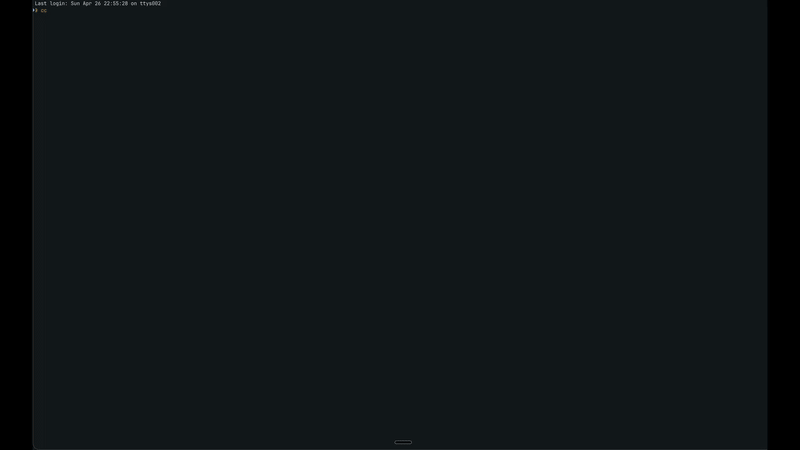

# Garmin Workout Pipeline

[](https://pypi.org/project/garmin-workout-pipeline/)
[](https://github.com/k-schmidt/Garmin-Workout-Pipeline/blob/main/LICENSE)
[](https://github.com/k-schmidt/Garmin-Workout-Pipeline)
[](https://www.python.org/downloads/)

**Stop clicking through Garmin Connect's UI to build every workout.** Define workouts in YAML, or just tell Claude what you want in plain English — then push them straight to your watch.

Garmin Workout Pipeline is an open-source CLI and MCP server that compiles structured workout definitions into Garmin Connect API payloads. It supports running, cycling, and strength/cardio workouts with pace/HR/power zones, 84+ exercises, circuits, and weekly scheduling.

> **"Build me a Hyrox sim with 8 stations, 1km runs between each, and a 10-minute warmup."**
>
> That's a real prompt. The MCP server turns it into a fully structured Garmin workout and uploads it to your watch.

<p align="center">
  
</p>

---

## Why This Exists

If you've ever built a complex interval workout in Garmin Connect, you know the pain: endless dropdowns, no copy-paste, no version control, and good luck reusing that Hyrox sim you spent 15 minutes clicking together.

This tool lets you:

- **Write workouts as code** — YAML files you can version, share, and iterate on
- **Build workouts conversationally** — tell Claude what you want via MCP, and it handles the structure
- **Push to Garmin Connect in one command** — from terminal to watch in seconds
- **Manage your training library** — list, schedule, and delete workouts programmatically

---

## Quickstart

```bash
# Install
pip install garmin-workout-pipeline

# Set credentials
export GARMIN_EMAIL=you@example.com
export GARMIN_PASSWORD=your-password

# Push a workout to your watch
gwp push workouts/templates/hyrox-sim.yaml --zones workouts/zones.yaml
```

That's it. Workout is on Garmin Connect, ready to sync to your device.

---

## Two Ways to Build Workouts

### 1. YAML (version-controlled, repeatable)

```yaml
name: "Threshold Intervals"
type: running

steps:
  - warmup: { duration: "10:00", zone: easy }
  - run: { distance: "1km", pace: { min: "6:25/mi", max: "6:40/mi" } }
  - recovery: { duration: "2:00" }
  - run: { duration: "5:00", zone: threshold }
  - cooldown: { duration: lap, zone: easy }
```

### 2. Natural Language via MCP (conversational, fast)

Connect the MCP server to Claude Desktop or Claude Code, then just describe what you want:

> "Create a 5x1km workout at threshold pace with 2-minute recoveries, 10-minute warmup and cooldown"

Claude builds the structured workout, previews it, and uploads it — all through conversation.

---

## MCP Server Setup

24 tools for full workout lifecycle management through any MCP-compatible client.

### Claude Code

```bash
claude mcp add garmin-workouts \
  -e GARMIN_EMAIL=your-email@example.com \
  -e GARMIN_PASSWORD=your-password \
  -- garmin-mcp
```

### Claude Desktop

Add to `~/Library/Application Support/Claude/claude_desktop_config.json`:

```json
{
  "mcpServers": {
    "garmin-workouts": {
      "command": "garmin-mcp",
      "env": {
        "GARMIN_EMAIL": "your-email@example.com",
        "GARMIN_PASSWORD": "your-password"
      }
    }
  }
}
```

<details>
<summary><strong>All 24 MCP Tools</strong></summary>

| Category | Tools |
| --- | --- |
| Workout | `create_workout`, `get_workout`, `set_workout_name`, `clear_workout` |
| Steps | `add_warmup`, `add_cooldown`, `add_run`, `add_bike`, `add_exercise`, `add_rest`, `add_recovery`, `remove_step` |
| Circuits | `add_circuit`, `end_circuit` |
| Garmin Connect | `preview_upload`, `upload_workout`, `list_workouts`, `delete_workout` |
| Reference | `list_exercises`, `get_zones`, `validate_workout` |
| Templates | `save_yaml`, `load_template`, `list_templates` |

</details>

---

## CLI Reference

```bash
gwp push <file> --zones <zones.yaml>            # Upload workout to Garmin Connect
gwp push <file> --zones <zones.yaml> --schedule 2026-04-29  # Upload + schedule
gwp push <file> --zones <zones.yaml> --dry-run   # Preview JSON without uploading
gwp validate <file> --zones <zones.yaml>          # Compile and validate only
gwp list                                          # List workouts on Garmin Connect
gwp delete <workout-id>                           # Delete a workout
gwp zones --zones <zones.yaml>                    # Show resolved zone values
```

---

## Workout Types

### Running

Pace targets, HR zones, distance and time-based intervals.

```yaml
name: "Speed 400s"
type: running
steps:
  - warmup: { duration: "10:00", zone: easy }
  - run: { distance: "400m", pace: { min: "5:30/mi", max: "5:45/mi" } }
  - recovery: { duration: "1:30" }
  - cooldown: { duration: "10:00", zone: easy }
```

### Strength / Cardio

84 exercises with rep counts, weights, and circuit support.

```yaml
name: "Hyrox Strength"
type: strength
steps:
  - warmup: { duration: lap, exercise: rowing_machine }
  - circuit:
      iterations: 4
      steps:
        - exercise: { exercise: wall_ball, reps: 20, weight: 13 }
        - exercise: { exercise: weighted_lunge, reps: 20, weight: 45 }
        - rest: { duration: "2:00" }
  - cooldown: { duration: lap, exercise: rowing_machine }
```

### Cycling

Power zones, FTP percentages, and duration-based blocks.

```yaml
name: "Sweet Spot"
type: cycling
steps:
  - warmup: { duration: "10:00", zone: z2 }
  - bike: { duration: "20:00", zone: threshold }
  - cooldown: { duration: "5:00" }
```

---

## Step Types Reference

| Type | End Conditions | Targets |
| --- | --- | --- |
| `warmup` | duration, lap | zone, exercise |
| `cooldown` | duration, lap | zone, exercise |
| `run` | duration, distance, lap | zone, pace, hr |
| `bike` | duration, distance, lap | zone, power, power_pct |
| `recovery` | duration, distance, lap | zone |
| `exercise` | duration, reps, lap | — |
| `rest` | duration | — |
| `circuit` | iterations | nested steps |

---

## Zones

Define your training zones once in `workouts/zones.yaml` with HR, pace, and power targets per sport. The compiler resolves zone names like `threshold`, `z2`, and `easy` to Garmin API target values.

---

## Installation Options

### From PyPI (recommended)

```bash
pip install garmin-workout-pipeline
```

### From GitHub

```bash
uv tool install git+https://github.com/k-schmidt/Garmin-Workout-Pipeline.git
```

### From Source

```bash
curl -LsSf https://astral.sh/uv/install.sh | sh
git clone https://github.com/k-schmidt/Garmin-Workout-Pipeline.git
cd Garmin-Workout-Pipeline
uv sync
```

---

## Project Structure

```
garmin_pipeline/
  mcp_server.py          # MCP server for Claude Desktop/Code
  cli.py                 # Click CLI (gwp command)
  compiler.py            # Workout model → Garmin API JSON
  exercises.py           # Exercise name → Garmin category/name registry
  loader.py              # YAML parser with !include support
  models.py              # Pydantic workout models
  sync.py                # Garmin Connect auth and upload
  zones.py               # Zone resolution (HR, pace, power)
workouts/
  zones.yaml             # Training zone definitions
  templates/             # Workout YAML files
tests/
  fixtures/              # Golden reference JSON
  test_compiler.py       # Compiler golden tests
  test_loader.py         # YAML loading and !include
  test_models.py         # Step parsing
  test_zones.py          # Zone resolution
```

---

## Development

```bash
uv run pytest -v              # run tests
uv run ruff check . --fix     # lint
uv run ruff format .          # format
```

---

## Contributing

Contributions welcome. Open an issue or submit a PR — whether it's a new exercise, a workout template, a bug fix, or documentation improvement.

---

## License

[MIT](LICENSE)
